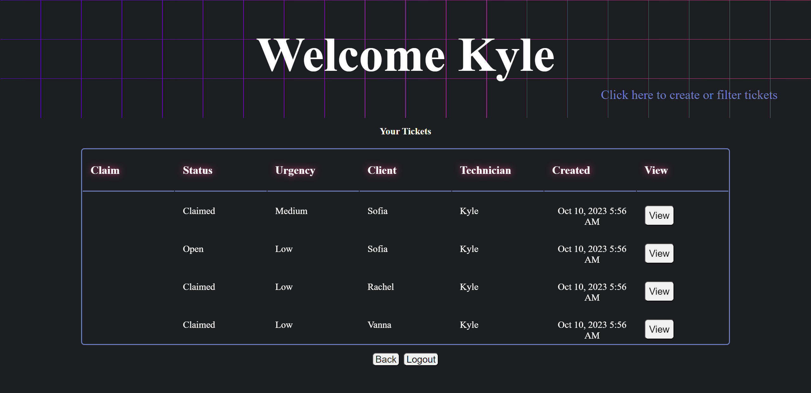
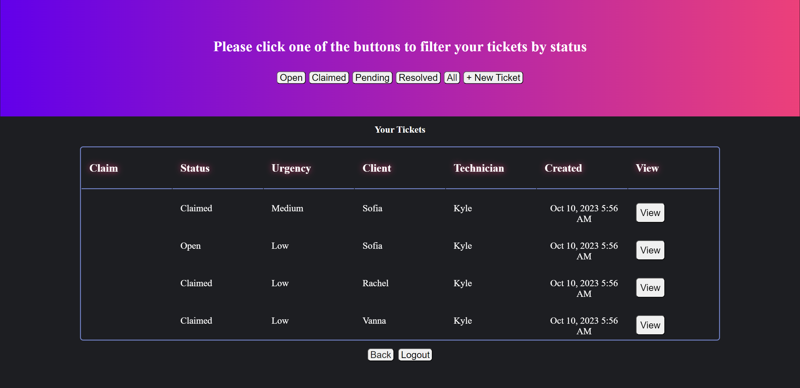
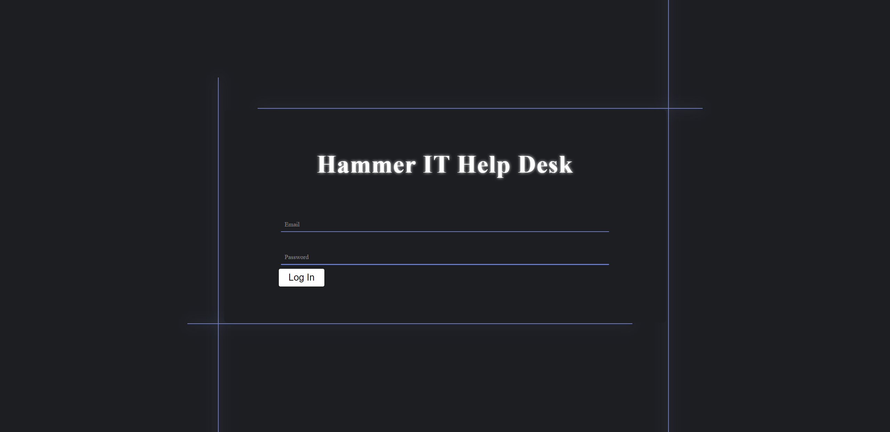
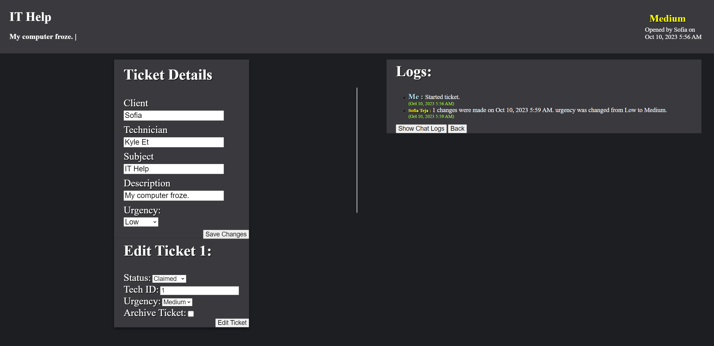
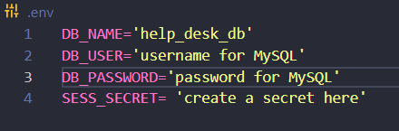

# Help Desk

## Description

As technology becomes an integral part of everyday life it becomes important for a person or business to have people well versed in making sure it works properly. The ease that technology makes everyday life, it also comes with challenges when the tech we are relying on doesn't perform as intended. In the case of businesses, if a piece of their technology isn't performing as intended it can lead to loss of productivity at best and the loss of profit / death of the company if the issue isn't resolved in a timely manner. This project aims to create an internal help desk to allow for a group or business to handle tickets from employees to send to their IT department to seek help and resolution of their technical problems. This project includes building a database, safely storing user passwords, and incorporating data from the database onto the front-end of the user.

The technologies used were: Express, Sequelize, Handlebars, MySQL, HTML, CSS, Javascript, Anime.js. The main challenge faced in this project were centered around pulling relevant data from the database at the correct time and getting it onto our handlebars file. In future development, we aim to use React.js rather than Handlebars due to the limitations of Handlebars having to reload the screen or fire off a document location redirect in order to display newly changed information from the database.

A link to the deployed site can be found [here](https://afternoon-ravine-50223-4c951dfeba48.herokuapp.com/)

Screenshots of deployed application:

Homepage:

Login:

View Ticket:

## Table of Contents

- [Installation](#installation)
- [Usage](#usage)
- [License](#license)
- [Contributing](#contributing)
- [Test](#test)
- [Questions](#questions)
- [Credit](#credit)

## Installation

### Programs needed for this project:

- GitBash (windows) or Terminal (Mac)
- Node.js
- mySQL2
- Insomnia

Locate a suitable place where you would like to download this repository. Once found, copy the repositories SSH or HTTPS to clone through the terminal or download the zipfile from GitHub. After it is downloaded, please ensure that node.js is installed. Once it is installed and at least version 18 or higher, go to your terminal, navigate to the directory that contains this repository. Once there, type in "npm i" to download the required dependencies.

Before launching the application, a mySQL server must be up and running. From the integrated terminal or the command line, please type in "mysql -u root -p" if your mysql account has a password or "mysql -u root" if you do not have a password set up. Once the server has been connected, please navigate to the db folder and type in "SOURCE schema.sql;".

Once the mySQL server is up and running please create a .env file at the level of server.js. Within that .env file be sure it looks like the following framework with your information filled in for the DB_user & DB_password:

When that .env file is completed navigate to the server.js level and open up a terminal and type in "npm run seed". From there type in "npm run start", "npm start", or "node server.js". Once the server is up, you should see a listening message in the terminal signaling it is on. Navigate over to a browser of your choice and go to http://localhost:3001 to interact with this application.

## Usage

This repository is allowed for use in a learning environment to evaluate and analyze.

## License

    Please see the MIT license found in the repository. To learn more, please click the license badge at the top of the README.MD

## Contributing

- Sequelize for their [modules](hhttps://sequelize.org/)
- mySQL2 for their [modules](https://www.npmjs.com/package/mysql2)
- dotenv for their [modules](https://www.npmjs.com/package/dotenv)
- Express for their [modules](https://expressjs.com/)
- nodemon for their [modules](https://www.npmjs.com/package/nodemon)
- Hyperplexed for their tutorials on [CSS animations](https://www.youtube.com/c/Hyperplexed)
- Anime.js for their [library](https://animejs.com/)
- UCI BootCamp for the acceptance criteria.

## Questions

Emails:

- Kyle Etrata - kyleochata@gmail.com
- Bliss Oros - kyleblissoros@gmail.com
- James Brainard - james.brainard202@gmail.com
- Adrian Cheung - ac983042820@gmail.com

GitHub Profiles:

- Kyle Etrata - https://github.com/kyleochata
- Bliss Oros - https://github.com/kybliss
- James Brainard - https://github.com/James-Brainard
- Adrian Cheung - https://github.com/GSwordGCil

## Credit

This project was created by Kyle Etrata, Adrien Cheung, James Brainard, Kyle Oros.
